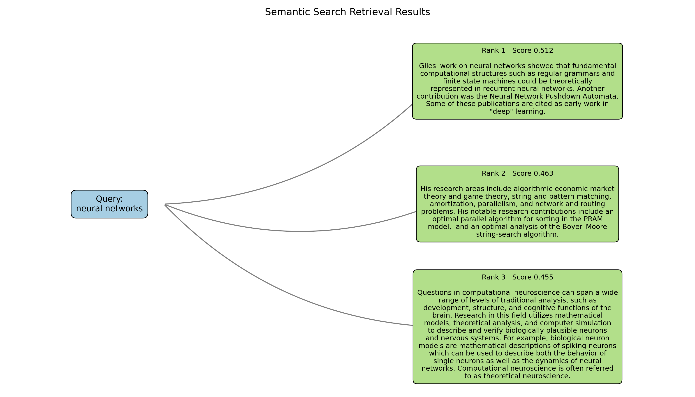

# Semantic Search Engine (BERT, PyTorch)

A modular **semantic search engine** built using **BERT embeddings and PyTorch**, focused purely on **semantic retrieval** (no generation, no RAG).

This project demonstrates how modern semantic search works using dense vector embeddings and cosine similarity.

**Pipeline:**  
Offline Indexing → Online Semantic Search

---

## Project Overview

This system works by:

- Encoding documents using a **frozen BERT encoder**
- Generating embeddings offline
- Encoding queries at runtime
- Ranking results using cosine similarity

The project intentionally avoids high-level training abstractions to clearly demonstrate the core mechanics of semantic retrieval.

---

## Key Features

- Frozen `bert-base-uncased` encoder
- Mean pooling with attention masks
- Cosine similarity–based ranking
- Offline indexing + online search separation
- Paragraph-level Wikipedia corpus
- Topic-focused corpus generation
- Automated retrieval flow visualization
- Clean modular Python project (no notebooks)
- No HuggingFace Trainer abstraction

---

## Retrieval Flow Visualization



The visualization is automatically generated from search results and shows:

Query → Ranked Results (with scores)

---

## Architecture

```
Wikipedia Corpus
        ↓
BERT Encoder (Frozen)
        ↓
Embedding Index (.pt)
        ↓
Query Encoding
        ↓
Cosine Similarity Search
        ↓
Top-K Results
```

---

## Project Structure

```
semantic-search-engine/
│
├── config.py
├── data/
│   └── corpus.txt
│
├── index/
│   ├── docs.txt
│   ├── raw_docs.txt
│   └── embeddings.pt
│
├── indexing/
│   └── build_index.py
│
├── model/
│   └── encoder.py
│
├── search/
│   └── searcher.py
│
├── scripts/
│   ├── build_wiki_corpus.py
│   └── visualize_results.py
│
├── utils/
│   ├── pooling.py
│   └── preprocessing.py
│
├── search_results.png
│   
│
└── README.md
```

---

## How to Run

Run everything from the project root.

### 1) Build Wikipedia Corpus

```bash
python scripts/build_wiki_corpus.py --max-paragraphs 2000
```

Creates:

```
data/corpus.txt
```

---

### 2) Build Embedding Index

```bash
python indexing/build_index.py
```

Creates:

```
index/docs.txt
index/raw_docs.txt
index/embeddings.pt
```

---

### 3) Run Semantic Search

```bash
python search/searcher.py
```

Enter a query to retrieve top semantic matches.

This generates:

```
results.json
```

---

### 4) Generate Retrieval Visualization

```bash
python scripts/visualize_results.py
```

This reads `results.json` and creates:

```
search_results.png
```

---

## Configuration

Edit `config.py` to control:

- `MODEL_NAME`
- `BATCH_SIZE`
- `MAX_LENGTH`
- `TOP_K`

---

## Example Output

```
Query: "How does gradient descent work?"

Top Results:
1. Optimization algorithms explanation
2. Neural network training paragraph
3. Gradient-based learning overview
```

---

## Tech Stack

- Python
- PyTorch
- HuggingFace Transformers (encoder only)
- BERT (`bert-base-uncased`)
- NumPy
- Wikipedia corpus (Wiki40B)
- Matplotlib (visualization)

---

## What This Project Demonstrates

- Dense semantic retrieval
- Transformer-based embeddings
- Offline indexing pipelines
- Vector similarity search
- Query-to-result visualization
- Modular ML engineering design

---

## Author

**Sai Srujith Diddi**
